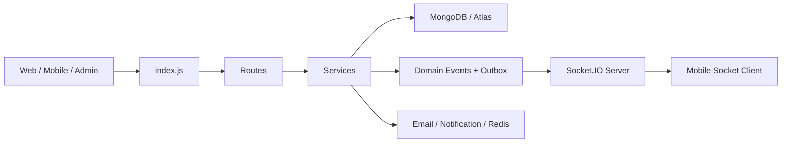

# App Flow Dormitory Graduation

Tài liệu này tóm tắt theo kiểu "module nào làm gì" để dùng khi bảo vệ hoặc phản biện.

## 1) Bản đồ kiến trúc tổng quan

Hệ thống được chia thành 4 lớp chính:

- Backend Node.js/Express ở [index.js](index.js) làm entrypoint, mount toàn bộ routes, security, session, realtime và event dispatcher.
- Web app server-rendered dùng EJS, phục vụ sinh viên, admin, quota, viewer phòng và các trang nghiệp vụ.
- Mobile app Expo trong thư mục [mobile](mobile) dùng cho sinh viên, gọi API qua `/api/student-app/*`, lưu token bằng SecureStore, và nhận realtime bằng Socket.IO.
- Docker dùng để đóng gói backend production cùng Redis cho adapter Socket.IO.

## 2) Backend entrypoint làm gì

[index.js](index.js) là file điều phối chính. Nó:

- Validate env và bật Sentry trước khi load các module khác.
- Cấu hình session, Passport, security middleware, rate limit, body parser, static assets.
- Mount toàn bộ route nghiệp vụ như allocation, registration, room viewer, notification, maintenance, mobile facade.
- Khởi động realtime server qua `setupStudentSocketServer`.
- Khởi động dispatcher cho event bền vững qua `startDomainEventDispatcher`.

Nói ngắn gọn: file này không xử lý nghiệp vụ sâu, mà là nơi ráp hệ thống lại thành một app chạy được.

## 3) Phân phòng / auto allocation

Luồng phân phòng nằm chủ yếu ở:

- [src/routes/allocation-routes.js](src/routes/allocation-routes.js)
- [src/services/allocationService.js](src/services/allocationService.js)
- các schema liên quan như `AllocationCycle`, `AllocationPolicy`, `AllocationRegistration`, `RoomAllocation`

### Nhiệm vụ từng phần

- `allocation-routes.js`: nhận request của admin, tạo policy, tạo cycle, chạy auto assign, lấy dashboard phân loại quick approve và manual review.
- `allocationService.js`: là nơi tính toán thật sự. Nó chấm điểm hồ sơ, sắp xếp ranking, kiểm tra sức chứa, chọn phòng phù hợp, ghi allocation, cập nhật occupancy và phát domain events.
- `RoomAllocation`: lưu kết quả xếp phòng cuối cùng.
- `DormitoryCollection`/room data: được cập nhật occupant khi sinh viên được gán phòng.
- `AllocationAuditLog`: lưu dấu vết thao tác để truy vết khi phản biện.

### Cách phân phòng đang chạy

1. Admin tạo hoặc chọn policy cho năm học.
2. Admin tạo allocation cycle.
3. Hệ thống lấy danh sách đăng ký `PENDING`.
4. `calculateSmartRankingScore()` tính điểm theo:
   - khoảng cách từ nhà,
   - khó khăn tài chính,
   - mức ưu tiên.
5. Danh sách được sort theo `smartScore`.
6. Hệ thống chia thành:
   - `quickApproveList`: phần tự động duyệt,
   - `manualReviewList`: phần cần xem tay.
7. Khi auto assign:
   - tìm phòng phù hợp,
   - tạo `RoomAllocation`,
   - cập nhật occupant trong dormitory,
   - cập nhật trạng thái đăng ký,
   - phát domain event `student.assigned` và `application.updated`.

### Điểm quan trọng để trả lời phản biện

- Hệ thống không phân phòng theo kiểu random thuần túy; có ranking và fairness summary.
- Có giới hạn theo số giường trống, không vượt capacity.
- Có audit log và event bền vững, nên không phải click xong là mất dấu.

## 4) Chỗ xử lý GLB / 3D / 360

Chỗ này cần nói rất rõ: hiện tại hệ thống **không phải** pipeline GLB/Three.js thực thụ.

### Thực tế đang có

- Viewer phòng nằm ở [src/services/roomViewerService.js](src/services/roomViewerService.js) và [src/routes/room-viewer-routes.js](src/routes/room-viewer-routes.js).
- Cơ chế hiện tại là **Photo Sphere Viewer + panorama ảnh 360**, không phải GLB model.
- Panorama được upload qua route `/api/rooms/:roomId/upload-panorama` và lưu vào `src/uploads/panoramas`.
- `generateViewerConfig()` dựng cấu hình viewer, hotspots, scenes, caption, autorotate.

### Nếu bị hỏi “GLB xử lý ở đâu?”

Câu trả lời đúng theo code hiện tại là:

- Chưa có module xử lý GLB thật.
- `convertToPanorama()` trong [src/services/roomViewerService.js](src/services/roomViewerService.js) chỉ là placeholder, hiện chỉ kiểm tra file tồn tại rồi trả về đường dẫn cũ.
- Hệ thống đang trình diễn phòng bằng ảnh panorama 360, không phải asset `.glb`.

### Luồng viewer phòng

1. Admin upload panorama ảnh.
2. File được lưu vào `src/uploads/panoramas`.
3. Room schema giữ danh sách `panoramas` và `panoramaUrl`.
4. Route `/api/rooms/:roomId/viewer-config` trả config cho frontend.
5. Route `/rooms/:roomId/view` render EJS viewer full-screen.
6. Frontend dùng Photo Sphere Viewer để xoay, zoom, đổi scene, xem hotspot.

## 5) Chỗ tự động hoá phân phòng

Nếu cần trả lời ngắn gọn: tự động hoá phân phòng nằm ở `AllocationService` và các route allocation.

### Thành phần chính

- `getApprovalDashboard()`
  - tách hồ sơ thành quick approve và manual review.
  - tính fairness summary.
- `executeAutoAssignment()`
  - duyệt hồ sơ theo ranking.
  - tìm phòng còn chỗ.
  - tạo allocation và phát event.
- `publishDomainEvent()` + outbox dispatcher
  - đảm bảo event không phụ thuộc vào việc request HTTP còn sống hay không.

### Tóm tắt logic

- Tự động hoá không chỉ là “bấm một nút rồi gán phòng”.
- Nó gồm ranking, capacity check, ghi nhận trạng thái, audit log và realtime notification.

## 6) Realtime hoạt động như thế nào

Realtime server nằm ở:

- [src/realtime/student-socket-server.js](src/realtime/student-socket-server.js)
- [src/realtime/register-domain-event-bridge.js](src/realtime/register-domain-event-bridge.js)
- [src/realtime/redis-adapter.js](src/realtime/redis-adapter.js)
- [src/events/durable-event-publisher.js](src/events/durable-event-publisher.js)

### Luồng realtime chuẩn

1. Nghiệp vụ backend tạo domain event, ví dụ:
   - `student.assigned`
   - `student.allocation_revoked`
   - `application.updated`
2. Event được ghi theo cơ chế durable outbox.
3. Dispatcher lấy event và publish ra bridge.
4. Bridge emit qua Socket.IO tới room theo student hoặc admin.
5. Mobile/web client nhận event và cập nhật UI cache.

### Điểm để nói khi phản biện

- Realtime không dựa trên polling loop.
- Socket server hỗ trợ cả session web và JWT mobile để tương thích ngược.
- Nếu Redis fail, hệ thống vẫn fallback sang broadcast local thay vì crash.

### Client mobile nhận realtime

- `mobile/src/realtime/socket.ts`
  - tạo socket connection, tự reconnect, lấy token từ `TokenStore`.
- `mobile/src/realtime/useSocketEvents.ts`
  - map event server → React Query cache → local push notification.

## 7) Mobile app build kiểu gì

Mobile app nằm trong [mobile/package.json](mobile/package.json) và dùng Expo / React Native.

### Stack build

- Expo SDK 52.
- `expo-router` cho routing.
- `expo-secure-store` để giữ access token và refresh token.
- `socket.io-client` cho realtime.
- `@tanstack/react-query` cho cache và sync dữ liệu.
- `eas.json` định nghĩa build profile development, preview, local-apk, production.

### Luồng build

1. App đọc cấu hình từ [mobile/app.json](mobile/app.json).
2. `mobile/src/config.ts` chọn base URL theo platform và môi trường.
3. `mobile/src/api/client.ts` dựng axios client với `/api/student-app`.
4. Login gọi `/auth/mobile/login`.
5. Token lưu vào SecureStore qua `TokenStore`.
6. Realtime socket tự nối lại bằng token mới khi reconnect.

### Build profile cần nhớ

- `development`: development client, APK internal.
- `preview`: APK internal.
- `local-apk`: debug APK bằng Gradle command.
- `production`: Android App Bundle.

### Câu trả lời ngắn khi bị hỏi

- Mobile không build bằng React web thường; nó build theo Expo/EAS.
- Dev thì chạy `expo start` hoặc `expo run:android`.
- Production thì dùng EAS build theo profile trong [mobile/eas.json](mobile/eas.json).

## 8) Mobile realtime và auth

Auth mobile tách riêng trong:

- [src/auth/mobileTokenService.js](src/auth/mobileTokenService.js)
- [src/routes/student/mobile/index.js](src/routes/student/mobile/index.js) nếu cần đối chiếu facade route
- [mobile/src/api/auth.ts](mobile/src/api/auth.ts)
- [mobile/src/store/authStore.ts](mobile/src/store/authStore.ts)

### Cách chạy

- Web sinh viên vẫn có thể dùng session truyền thống.
- Mobile dùng JWT access + refresh token.
- Refresh token được hash và lưu DB, có rotate khi refresh, revoke khi logout.
- Mobile websocket auth lấy access token hiện tại từ SecureStore.

### Nếu bị hỏi “Tại sao hai kiểu auth?”

Trả lời đúng là:

- Web cần tương thích session cũ và các trang EJS.
- Mobile cần token-based auth, dễ refresh, dễ gọi API từ app native.
- Hệ thống giữ cả hai để không phải phá web hiện có.

## 9) Các module backend liên quan khác

Một số nhóm module hay bị hỏi thêm:

- `src/routes/notificationRoutes.js` và `src/services/notificationService.js`: thông báo nghiệp vụ.
- `src/routes/maintenance-routes.js`: tạo và xử lý yêu cầu bảo trì.
- `src/routes/enhanced-application-routes.js`: form đăng ký nâng cao, ranking, và cửa vào 360 viewer.
- `src/routes/public-routes.js`: các trang công khai.
- `src/routes/auth-routes.js`: login web theo session.
- `src/routes/student/mobile/*`: facade API cho mobile.

## 10) Docker / triển khai

Docker được định nghĩa ở [Dockerfile](Dockerfile) và [docker-compose.yml](docker-compose.yml).

### Dockerfile

- Stage `builder` cài dependencies production bằng `npm ci --omit=dev`.
- Stage `production` copy node_modules và toàn bộ source.
- Chạy bằng user không phải root.
- Expose port 5000.
- Có healthcheck vào `/health`.
- Xóa một số thư mục dev như `mobile`, `tests`, `scripts` trong image production.

### docker-compose.yml

- Service `app` build từ Dockerfile, target `production`.
- Port map `5000:5000`.
- Inject biến môi trường cho MongoDB Atlas, session secret, mobile JWT secret, QR secret.
- Service `redis` chạy riêng để làm adapter cho Socket.IO.
- Mongo local bị comment out, tức mặc định ưu tiên Atlas.

### Ý nghĩa khi phản biện

- Docker không chỉ để “chạy thử”, mà là để chốt môi trường production nhất quán.
- Redis là phần hỗ trợ realtime scale-out.
- Atlas là database chính, Docker không nhét MongoDB vào mặc định.

## 11) Một câu chốt ngắn gọn để thuyết trình

"Backend của em là một hệ thống Express theo mô-đun: allocation xử lý phân phòng theo ranking và capacity, room viewer xử lý panorama 360 chứ chưa phải GLB, realtime đi theo domain event + Socket.IO + outbox, mobile là Expo/EAS app dùng JWT riêng, còn Docker đóng gói backend production với Redis để hỗ trợ realtime."

## 12) Nếu cần mở rộng sau này

Một số hướng nâng cấp hợp lý:

- Bổ sung thật sự pipeline GLB/Three.js nếu muốn xem mô hình 3D phòng.
- Tách mobile facade thành OpenAPI rõ hơn.
- Viết sơ đồ sequence cho allocation/realtime để bảo vệ dễ hơn.
- Bổ sung test cho event bridge và mobile auth refresh.