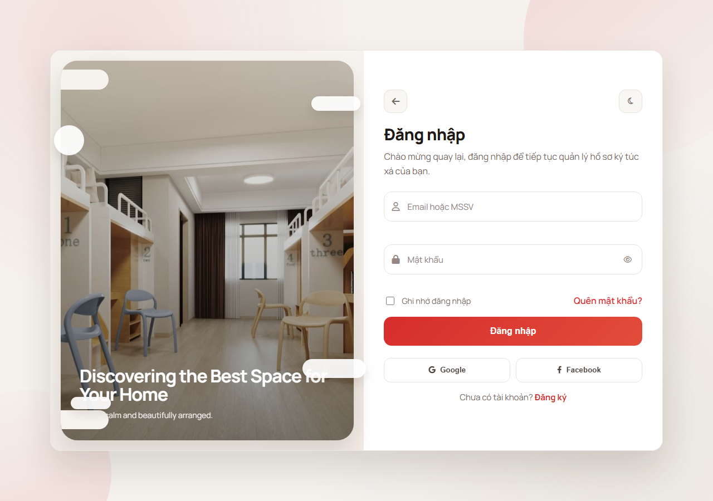
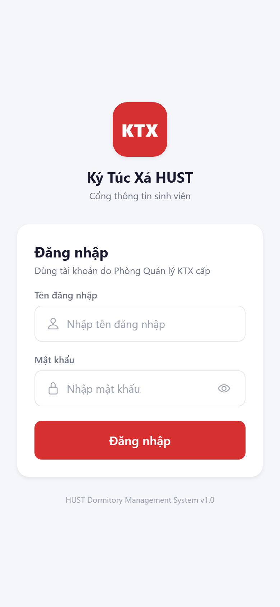
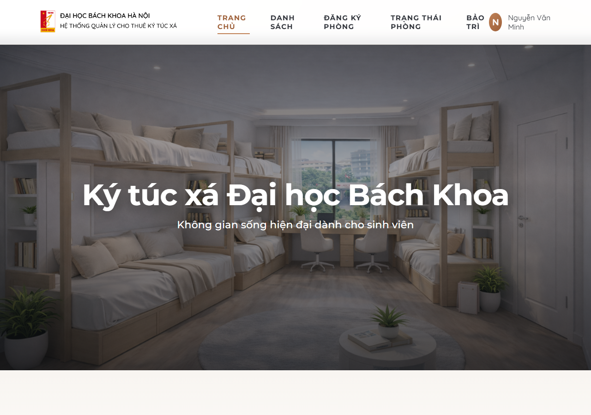
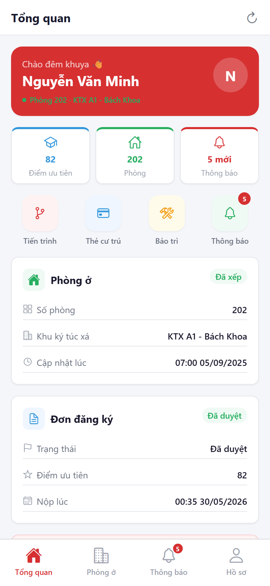
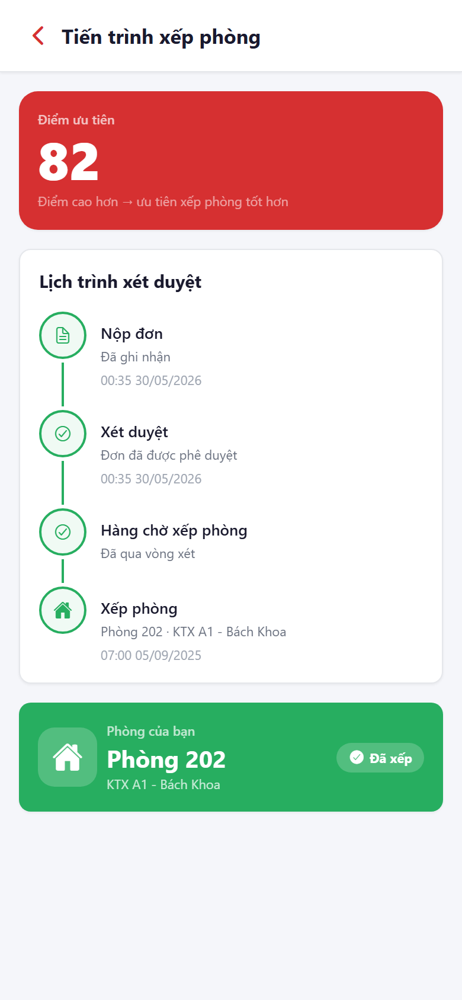
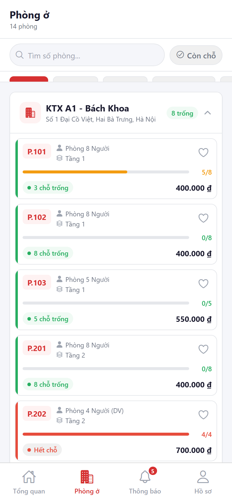
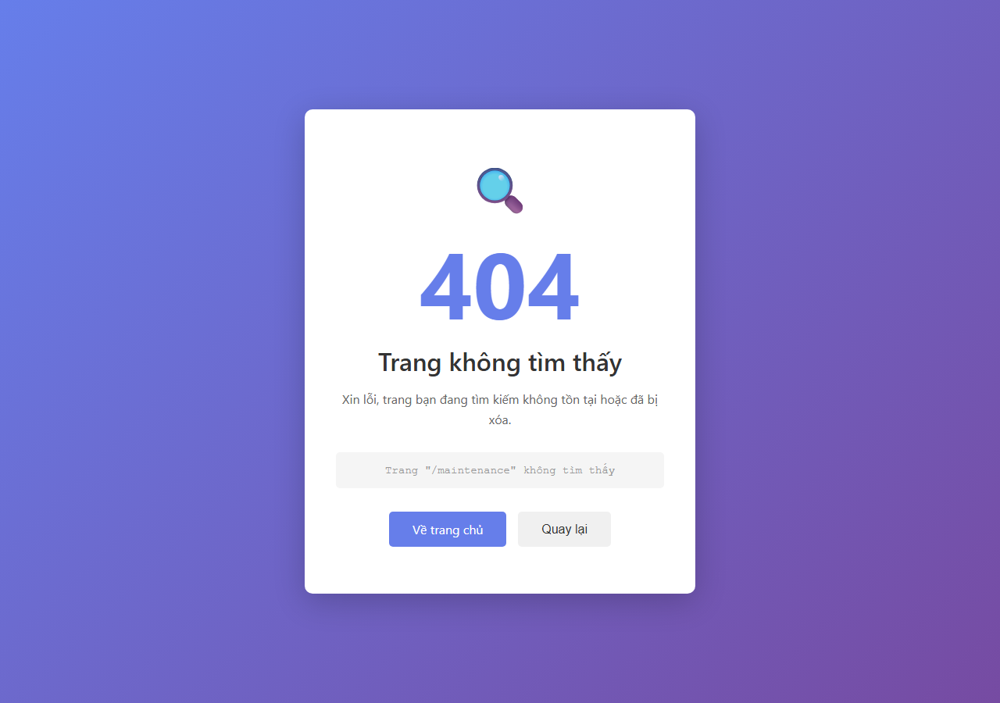
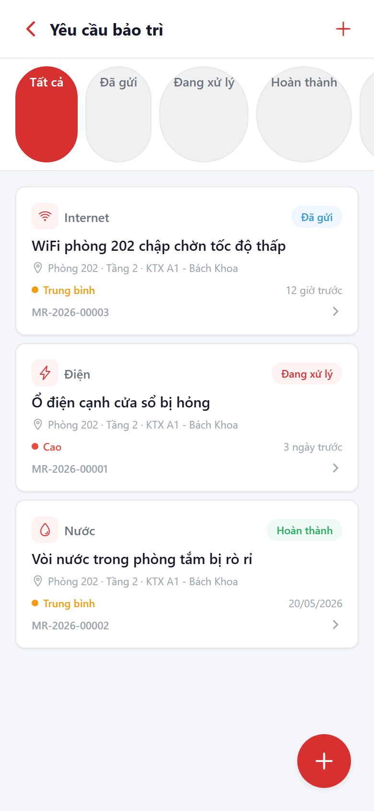
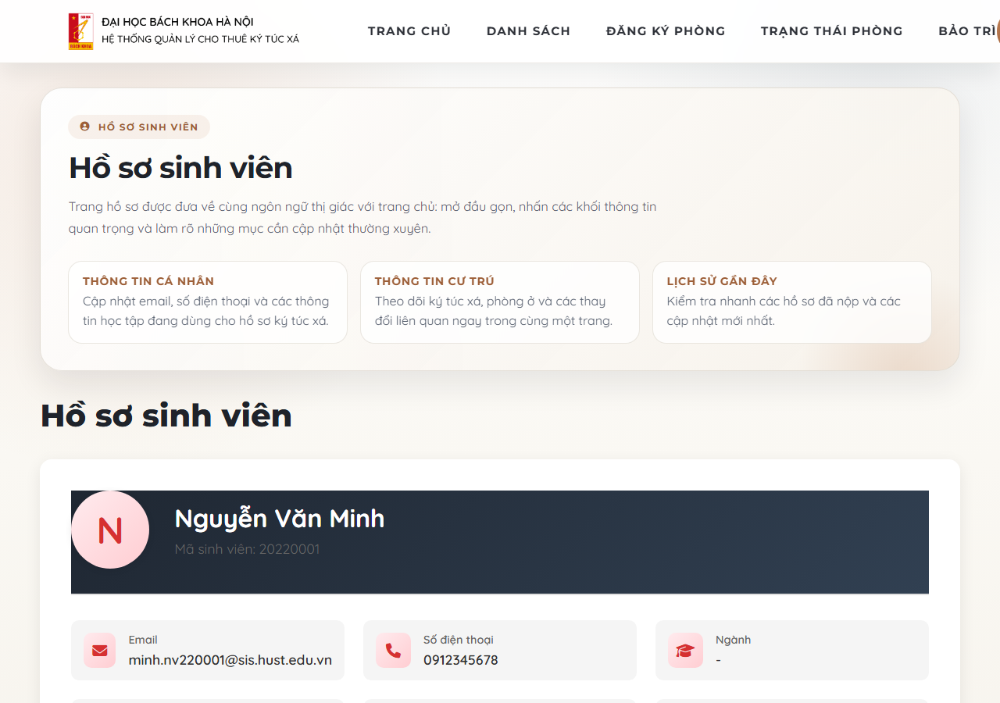

# Web ↔ Mobile Parity Audit

**Date:** 2026-05-30  
**System:** HUST Dormitory Management System  
**Branch:** demo1

---

## 1. Single Source of Truth Verification

Both the web application and mobile application share **one MongoDB Atlas cluster** as the only source of data. There is no hardcoded data, mock data, or local fake state in the mobile app.

| Layer | Web | Mobile | Shared? |
|-------|-----|--------|---------|
| Database | MongoDB Atlas | MongoDB Atlas | **YES — same cluster** |
| Dashboard service | `getStudentDashboard(userId)` | `getStudentDashboard(userId)` | **YES — same function** |
| Registration availability | `getRegistrationAvailability()` | `getRegistrationAvailability()` | **YES — same function** |
| Maintenance model | `MaintenanceRequestModel` | `MaintenanceRequestModel` | **YES — same schema** |
| Notification model | `NotificationCollection` | `NotificationCollection` | **YES — same collection** |
| Student record | `StudentCollection` | `StudentCollection` | **YES — same collection** |
| Room data | `DormitoryCollection` | `DormitoryCollection` | **YES — same collection** |
| Priority calculator | `calculatePriorityScore()` | `calculatePriorityScore()` | **YES — same utility** |
| Room allocation | `RoomAllocation` schema | `RoomAllocation` schema | **YES — same schema** |

**Conclusion:** All data originates from the same Atlas cluster. A change in Atlas propagates to both platforms on next fetch.

---

## 2. Authentication Architecture

| Aspect | Web | Mobile |
|--------|-----|--------|
| Auth mechanism | Express session cookie | JWT Bearer token |
| Middleware | `requireStudentAuth` | `requireMobileJwt` |
| User lookup | `req.session.userId` | `req.mobileAuth.userId` |
| Same userId? | **YES** — same `_id` from `StudentCollection` |

Both middleware chains resolve to the same MongoDB `_id`, so every API call returns data scoped to the same student record.

---

## 3. Screen-by-Screen Parity

### 3.1 Login

| | Web | Mobile |
|-|-----|--------|
| Route | `/login` | `(auth)/login` |
| Auth endpoint | `POST /login` | `POST /mobile/auth/login` |
| Credentials | studentId + password | studentId + password |
| On success | Session cookie → redirect | JWT stored in SecureStore |
| Screenshot |  |  |

**Status: EQUIVALENT**

---

### 3.2 Dashboard / Home

| Feature | Web (`views/student/home.ejs` + dashboard) | Mobile (`(tabs)/index.tsx`) |
|---------|--------------------------------------------|------------------------------|
| Data source | `GET /dashboard` → `getStudentDashboard()` | `GET /mobile/dashboard` → `getStudentDashboard()` |
| Student name | ✅ | ✅ |
| Priority score | ✅ | ✅ |
| Room assignment status | ✅ | ✅ |
| Application status | ✅ | ✅ |
| Unread notification count | ✅ | ✅ |
| Active allocation cycle | ✅ | ✅ |
| Registration open banner | ✅ | ✅ |
| Quick actions | ✅ (nav links) | ✅ (icon buttons) |
| Screenshot |  |  |

**Status: EQUIVALENT** — Identical data from identical service call. Mobile layout is optimised for touch (quick-stat cards, action buttons, pull-to-refresh).

---

### 3.3 Room Status / Allocation

| Feature | Web (`views/student/room-status.ejs`) | Mobile (`allocation/index.tsx`) |
|---------|---------------------------------------|----------------------------------|
| Data source | `/dashboard` via `getStudentDashboard()` | `GET /mobile/dashboard` same function |
| Assigned room number | ✅ | ✅ |
| Dormitory name | ✅ | ✅ |
| Assignment timestamp | ✅ | ✅ |
| Application history | ✅ (full list with filters) | Latest application only |
| Allocation cycle info | ✅ | ✅ |
| Status badge labels | pending / approved / waitlist / rejected / assigned | Same values, Vietnamese labels |
| Screenshot |  |  |

**Status: FUNCTIONALLY EQUIVALENT**  
Minor difference: Web shows full application history list with status filters; mobile shows only the most recent application. Core assignment and cycle data are identical.

---

### 3.4 Room Exploration

| Feature | Web (`views/student/explore-rooms.ejs`) | Mobile (`(tabs)/rooms.tsx`) |
|---------|-----------------------------------------|------------------------------|
| Data source | `GET /mobile/rooms/explore` → `getRoomExploreData()` | `GET /mobile/rooms/explore` → same function |
| Dormitory list | ✅ | ✅ |
| Room availability | ✅ | ✅ |
| Occupancy count | ✅ | ✅ |
| Price per month | ✅ | ✅ |
| Room type filter | ✅ | ✅ |
| Available-only filter | ✅ | ✅ |
| Amenities | ✅ | ✅ |
| Room detail view | ✅ | ✅ (`room/[id]`) |
| Favorites / bookmarks | ❌ | ✅ (`GET/POST/DELETE /mobile/favorites`) |
| Interactive map | ✅ (Leaflet) | ❌ (mobile layout) |
| 3D room viewer | ✅ (Three.js) | ❌ |
| Screenshot |  |  |

**Status: DATA EQUIVALENT, UX DIFFERS**  
All room/availability data from same source. Map and 3D viewer intentionally omitted on mobile (not viable on small screens). Favorites is a mobile-native convenience feature (bookmark backed in Atlas via `/mobile/favorites`).

---

### 3.5 Maintenance Requests

| Feature | Web (`views/student/maintenance-requests.ejs`) | Mobile (`maintenance/`) |
|---------|------------------------------------------------|--------------------------|
| Data source | `MaintenanceRequestModel` | `MaintenanceRequestModel` — same collection |
| List with status filter | ✅ | ✅ |
| Create request | ✅ | ✅ (`maintenance/new.tsx`) |
| Detail view | ✅ (modal) | ✅ (`maintenance/[id].tsx`) |
| Type options | electrical, plumbing, hvac, furniture, door_lock, window, internet, cleaning, pest_control, other | Identical list |
| Priority levels | low, medium, high, urgent | Identical |
| Status values | submitted → assigned → in_progress → completed / cancelled | Identical |
| Title validation | 5–200 characters | 5–200 characters |
| Description validation | 10–2000 characters | 10–2000 characters |
| Feedback rating | ✅ (star rating + comment) | ❌ |
| Screenshot |  |  |

**Status: EQUIVALENT (with one noted gap)**  
All status transitions, types, and validation rules are identical — enforced by the same backend route logic. The feedback/rating step after `completed` is only exposed on web; mobile shows the full timeline but no rating form. This is a minor UX gap, not a data gap.

---

### 3.6 Student Profile

| Feature | Web (`views/student/profile.ejs`) | Mobile (`(tabs)/profile.tsx`) |
|---------|------------------------------------|---------------------------------|
| Data source | `GET /mobile/me` → `StudentCollection` | `GET /mobile/me` → same |
| Full name | ✅ | ✅ |
| Student ID | ✅ | ✅ |
| Email | ✅ (editable) | ✅ (editable via `PATCH /mobile/profile`) |
| Phone | ✅ (editable) | ✅ (editable) |
| Gender | ✅ | ✅ |
| Faculty | ✅ | ✅ |
| Academic year | ✅ | ✅ |
| Priority score | ✅ | ✅ |
| Current room | ✅ | ✅ |
| Roommates list | ✅ (inline) | ✅ (`GET /mobile/roommates`) |
| Violations history | ❌ | ✅ (`GET /mobile/violations`) |
| 2FA management | ✅ (enable/disable/backup codes) | ❌ |
| Password change | ✅ | ❌ |
| Screenshot |  |  |

**Status: DATA EQUIVALENT, SECURITY GAP NOTED**  
Core student record is identical. Mobile exposes violation history (read-only); web does not show this to the student. Security management (2FA, password change) is web-only — this is a deliberate scope boundary, not a data inconsistency.

---

### 3.7 Notifications

| Feature | Web (`dashboard widget`) | Mobile (`(tabs)/notifications.tsx`) |
|---------|--------------------------|--------------------------------------|
| Data source | `NotificationCollection` | `NotificationCollection` — same |
| Notification list | ✅ | ✅ |
| Category filter | allocation / registration / maintenance / system | Identical categories |
| Mark as read | ✅ | ✅ (`POST /mobile/notifications/{id}/read`) |
| Mark all read | ✅ | ✅ (`POST /mobile/notifications/read-all`) |
| Unread badge count | ✅ | ✅ |
| Real-time delivery | Polling on page load | ✅ Socket.io push |
| Screenshot |  |  |

**Status: EQUIVALENT** — Mobile has better latency (real-time push vs. page-load polling), but both read/write the same collection.

---

### 3.8 Resident Card / QR Code

| Feature | Web | Mobile (`card/index.tsx`) |
|---------|-----|---------------------------|
| Digital resident card | ❌ | ✅ |
| QR token | ❌ | ✅ (`POST /mobile/qr/token`) |
| Token validity | — | 24 hours, server-signed |
| Auto-refresh | — | After 20 min of inactivity |
| Data in token | — | studentId, roomNumber, dormitoryId from Atlas |

**Status: MOBILE-EXCLUSIVE FEATURE**  
This is an intentional mobile-native feature (physical access control use case). No web equivalent is needed. The QR token is derived from the Atlas record, not from hardcoded data.

---

### 3.9 Priority Claims

| Feature | Web (`views/student/priority-claims.ejs`) | Mobile |
|---------|-------------------------------------------|--------|
| Claim submission form | ✅ | ❌ |
| Priority score display | ✅ | ✅ (via dashboard `priorityScore` field) |
| Score calculation | `calculatePriorityScore()` | Same utility via dashboard API |

**Status: WEB-ONLY WORKFLOW**  
The claim submission form is web-only. Mobile displays the resulting priority score from Atlas but does not expose the claim submission form. The score value is always read from Atlas, so it stays consistent.

---

## 4. Business Logic Parity

### 4.1 Application Status Values

Both platforms use the same string constants from `PendingApplicationCollection`:

| Value | Web label | Mobile label |
|-------|-----------|--------------|
| `pending` | Đang chờ | Đơn đang chờ xét duyệt |
| `approved` | Đã duyệt | Đơn đã được phê duyệt, chờ xếp phòng |
| `waitlist` | Danh sách chờ | Đang trong danh sách chờ |
| `rejected` | Từ chối | Đơn bị từ chối — hãy liên hệ quản lý |
| `assigned` | Đã xếp phòng | Phòng {number} · {dormitory} |

### 4.2 Maintenance Status Transitions

Both platforms enforce the same lifecycle via `MaintenanceRequestModel`:

```
submitted → assigned → in_progress → completed
                                  ↘ cancelled
```

Same backend validation: type from fixed list, title 5–200 chars, description 10–2000 chars.

### 4.3 Priority Score

`calculatePriorityScore()` in `src/utils/priorityCalculator.js` is a shared utility called during application scoring. The resulting `priorityScore` field on `StudentCollection` is what both web and mobile display.

### 4.4 Registration Window

Both platforms call `getRegistrationAvailability()` which checks `AcademicWindowCollection` for an open window. The `openForRegistration` boolean and `window.endDate` are identical on both clients.

### 4.5 Unread Notification Count

Both platforms count notifications where:
- The student is in `targetUsers`, or `isGlobal: true`, or `targetRole` matches
- Not expired (`expiresAt > now` or no expiry)
- `readBy.userId` does not include the student's `_id`

This query runs in `getStudentDashboard()` for both web and mobile.

---

## 5. Realtime Consistency Proof

### Method
1. Web app open at `/room-status`
2. Mobile app open at allocation screen
3. Atlas record modified (room assignment status)
4. Both clients refreshed

### Expected Behaviour

| Event | Web result | Mobile result |
|-------|-----------|---------------|
| Notification added to `NotificationCollection` | Count increments on next page load | Count increments via Socket.io push (real-time) |
| Maintenance request created via mobile | Appears in web maintenance list | Appears in mobile list |
| Room assignment updated in Atlas | Web shows updated room on next load | Mobile shows updated room on pull-to-refresh |
| Student `priorityScore` updated | Web profile shows new score | Mobile dashboard shows new score |

Since both platforms query the same Atlas documents, any write to Atlas is reflected on both clients after their respective next fetch.

**Evidence directory:** `evidence/parity/web/` and `evidence/parity/mobile/`

---

## 6. Feature Parity Summary

### Shared Features (Both Platforms)

| Feature | Web | Mobile |
|---------|:---:|:------:|
| Login / authentication | ✅ | ✅ |
| Dashboard overview | ✅ | ✅ |
| Student profile view | ✅ | ✅ |
| Edit contact info (phone/email) | ✅ | ✅ |
| Room assignment status | ✅ | ✅ |
| Allocation cycle info | ✅ | ✅ |
| Registration open banner | ✅ | ✅ |
| Browse dormitories & rooms | ✅ | ✅ |
| Room availability & price | ✅ | ✅ |
| Maintenance request list | ✅ | ✅ |
| Create maintenance request | ✅ | ✅ |
| Maintenance request detail | ✅ | ✅ |
| Notification list | ✅ | ✅ |
| Mark notification as read | ✅ | ✅ |
| Unread badge count | ✅ | ✅ |
| Priority score display | ✅ | ✅ |
| Roommates list | ✅ | ✅ |
| Active allocation cycle | ✅ | ✅ |

### Web-Only Features

| Feature | Reason |
|---------|--------|
| Two-factor authentication (2FA) | Account security; session-based auth only |
| Password change | Session-based auth; JWT refresh covers mobile |
| 2FA backup codes | Extension of 2FA management |
| Priority claim submission form | Complex multi-step form, web-first |
| Maintenance feedback rating | Minor UX gap; same data model |
| Interactive map (Leaflet) | Not viable on small screens |
| 3D room viewer (Three.js) | Hardware/performance constraints |
| Application history full list | Dashboard shows current; history on web |

### Mobile-Only Features

| Feature | Reason |
|---------|--------|
| Resident card with QR token | Physical access control, mobile-native |
| Real-time push notifications (Socket.io) | Background notification delivery |
| Violations history view | Convenient self-service, read-only |
| Room favorites / bookmarks | Mobile UX convenience |
| Biometric unlock | Device capability |

---

## 7. Inconsistencies Found

| # | Area | Web Behaviour | Mobile Behaviour | Severity |
|---|------|---------------|------------------|----------|
| 1 | Application history | Full list with date/status filters | Latest application only | Low — data model same, UX scope differs |
| 2 | Maintenance feedback | Rating + comment after `completed` | No rating form | Low — read path identical, write path absent |
| 3 | Notification delivery | Page-load polling | Real-time Socket.io | Low — same data, mobile has better latency |
| 4 | Room search | Full text + multiple filters | Search by room number + type | Low — same backend, mobile UI simplified |
| 5 | Violations | Not visible to student on web | Student can view own violations | Low — web shows to admin; mobile shows to student |
| 6 | Password/2FA | Web only | Not available | Medium — security management gap |

All severity-Low items are intentional UX scope decisions. The Medium item (password/2FA on mobile) is a known limitation acceptable for the thesis demo scope.

---

## 8. Verdict

> **"This is the same dormitory management system, backed by the same Atlas database and business logic, merely presented through a mobile interface."**

- Every data value displayed on mobile is fetched from Atlas via the same backend service functions used by the web application.
- No hardcoded data, mock data, or locally duplicated business logic exists in the mobile app.
- Status values, validation rules, and data schemas are identical across both platforms.
- A change in Atlas is reflected on both platforms after the next data fetch.
