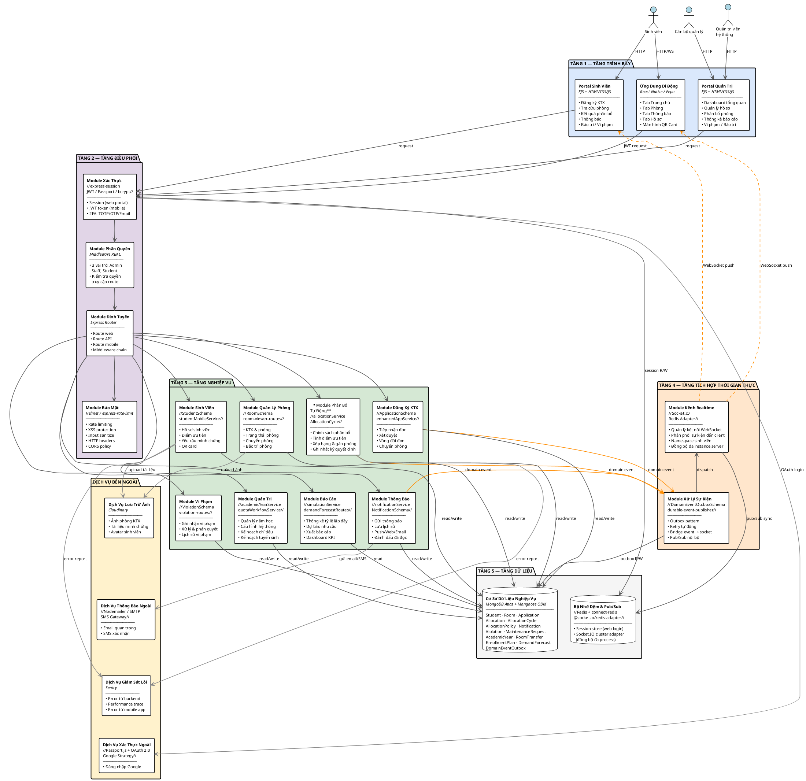

# Hướng dẫn vẽ Software Architecture Diagram
## Hệ thống Quản lý Ký túc xá — HUST

---

## Tổng quan cấu trúc sơ đồ

Sơ đồ được vẽ theo **chiều dọc từ trên xuống dưới**, gồm 6 vùng chính:
- Phía trên: **Nhóm người dùng** (actors)
- Giữa: **5 tầng kiến trúc** (từ trình bày → dữ liệu)
- Bên phải: **Dịch vụ bên ngoài** (external services)

---

## CẤU TRÚC CHI TIẾT TỪNG TẦNG

---

### [VÙNG 0 — NGƯỜI DÙNG] (nằm trên cùng)

Vẽ 3 icon người dùng, mỗi icon có nhãn:

```
[ Sinh viên ]     [ Cán bộ quản lý ]     [ Quản trị viên hệ thống ]
  (Student)         (Staff/Admin)           (Super Admin)
```

**Mũi tên:** Từ mỗi actor → xuống Tầng 1 (Tầng trình bày)

---

### [TẦNG 1 — TẦNG TRÌNH BÀY]
> Presentation Layer

Vẽ 3 hộp ngang hàng nhau:

```
┌──────────────────────┐  ┌──────────────────────┐  ┌──────────────────────┐
│   PORTAL SINH VIÊN   │  │   PORTAL QUẢN TRỊ    │  │  ỨNG DỤNG DI ĐỘNG   │
│  (Student Web Portal)│  │  (Admin Web Portal)  │  │  (Mobile App)        │
│                      │  │                      │  │                      │
│  • Trang chủ         │  │  • Dashboard tổng    │  │  Tab Trang chủ       │
│  • Đăng ký KTX       │  │    quan              │  │  Tab Phòng           │
│  • Tra cứu phòng     │  │  • Quản lý hồ sơ     │  │  Tab Thông báo       │
│  • Kết quả phân bổ   │  │  • Phân bổ phòng     │  │  Tab Hồ sơ           │
│  • Thông báo         │  │  • Thống kê báo cáo  │  │  Màn hình QR Card    │
│  • Lịch sử vi phạm   │  │  • Vi phạm/Bảo trì   │  │  Màn hình phân bổ   │
│  • Bảo trì           │  │  • Cài đặt hệ thống  │  │  Màn hình bảo trì   │
│                      │  │                      │  │                      │
│ ─── Công nghệ ──── │  │ ─── Công nghệ ──── │  │ ─── Công nghệ ──── │
│  EJS Template Engine │  │  EJS Template Engine │  │  React Native / Expo │
│  HTML / CSS / JS     │  │  HTML / CSS / JS     │  │  File-based Routing  │
└──────────────────────┘  └──────────────────────┘  └──────────────────────┘
```

**Mũi tên:** 3 hộp → xuống Tầng 2

---

### [TẦNG 2 — TẦNG ĐIỀU PHỐI]
> Orchestration / Gateway Layer

Vẽ 4 hộp ngang hàng nhau (hoặc 2x2):

```
┌─────────────────┐  ┌─────────────────┐  ┌─────────────────┐  ┌─────────────────┐
│ MODULE XÁC THỰC │  │MODULE PHÂN QUYỀN│  │MODULE ĐỊNH TUYẾN│  │ MODULE BẢO MẬT  │
│ (Auth Module)   │  │ (RBAC Module)   │  │ (Router Module) │  │(Security Module)│
│                 │  │                 │  │                 │  │                 │
│ • Session-based │  │ • 3 vai trò:    │  │ • Route web     │  │ • Rate limiting  │
│   (web portal)  │  │   Admin         │  │ • Route API     │  │ • XSS protection │
│ • JWT token     │  │   Staff         │  │ • Route mobile  │  │ • Input sanitize │
│   (mobile app)  │  │   Student       │  │ • Middleware     │  │ • HTTP headers  │
│ • 2FA (TOTP/    │  │ • Kiểm tra      │  │   chain         │  │ • CORS policy   │
│   OTP/Email)    │  │   quyền truy cập│  │                 │  │                 │
│                 │  │                 │  │                 │  │                 │
│── Công nghệ ───│  │── Công nghệ ───│  │── Công nghệ ───│  │── Công nghệ ───│
│ express-session │  │ Middleware RBAC  │  │ Express Router  │  │ Helmet.js       │
│ JWT / Passport  │  │ requireAuth.js  │  │ Express.js      │  │ express-rate-   │
│ bcrypt / TOTP   │  │ requireAdmin.js │  │                 │  │   limit         │
└─────────────────┘  └─────────────────┘  └─────────────────┘  └─────────────────┘
```

**Mũi tên:** Tầng 2 → xuống Tầng 3

---

### [TẦNG 3 — TẦNG NGHIỆP VỤ]
> Business Logic Layer

Vẽ 8 hộp, bố cục 4 cột × 2 hàng:

**Hàng trên (4 hộp):**

```
┌──────────────────┐  ┌──────────────────┐  ┌──────────────────┐  ┌──────────────────┐
│ MODULE SINH VIÊN │  │MODULE ĐĂNG KÝ KTX│  │MODULE PHÂN BỔ   │  │MODULE QUẢN LÝ   │
│ (Student Module) │  │(Registration Mod)│  │TỰ ĐỘNG          │  │PHÒNG            │
│                  │  │                  │  │(Auto Allocation)│  │(Room Management)│
│ • Hồ sơ sinh viên│  │ • Tiếp nhận đơn  │  │                 │  │                 │
│ • Ưu tiên/điểm  │  │ • Xét duyệt      │  │ • Chính sách    │  │ • KTX & phòng   │
│ • Yêu cầu minh  │  │ • Duyệt/từ chối  │  │   phân bổ       │  │ • Trạng thái    │
│   chứng          │  │ • Vòng đời đơn   │  │ • Tính điểm     │  │   phòng         │
│ • QR card        │  │ • Chuyển phòng   │  │   ưu tiên       │  │ • Chuyển phòng  │
│                  │  │                  │  │ • Xếp hạng &    │  │ • Bảo trì       │
│                  │  │                  │  │   gán phòng     │  │   phòng         │
│── Công nghệ ───│  │── Công nghệ ───│  │── Công nghệ ───│  │── Công nghệ ───│
│ StudentSchema   │  │ ApplicationSchema│  │allocationService│  │ RoomSchema      │
│ studentMobile   │  │ enhancedApp      │  │ AllocationCycle │  │ dormitory-routes│
│   Service.js    │  │   Service.js     │  │ AllocationPolicy│  │ room-viewer     │
└──────────────────┘  └──────────────────┘  └──────────────────┘  └──────────────────┘
```

**Hàng dưới (4 hộp):**

```
┌──────────────────┐  ┌──────────────────┐  ┌──────────────────┐  ┌──────────────────┐
│MODULE THÔNG BÁO  │  │  MODULE VI PHẠM  │  │  MODULE BÁO CÁO │  │ MODULE QUẢN TRỊ  │
│(Notification Mod)│  │(Violation Module)│  │ (Report Module) │  │ (Admin Module)   │
│                  │  │                  │  │                 │  │                  │
│ • Gửi thông báo  │  │ • Ghi nhận vi    │  │ • Thống kê tỷ   │  │ • Quản lý năm   │
│ • Lưu lịch sử   │  │   phạm nội quy   │  │   lệ lấp đầy   │  │   học / học kỳ   │
│ • Push/Web/Email │  │ • Xử lý & phán  │  │ • Dự báo nhu    │  │ • Cấu hình hệ   │
│ • Đánh dấu đã   │  │   quyết           │  │   cầu           │  │   thống          │
│   đọc            │  │ • Lịch sử vi     │  │ • Xuất báo cáo  │  │ • Kế hoạch chỉ  │
│                  │  │   phạm           │  │ • Dashboard KPI │  │   tiêu tuyển     │
│                  │  │                  │  │                 │  │   sinh           │
│── Công nghệ ───│  │── Công nghệ ───│  │── Công nghệ ───│  │── Công nghệ ───│
│notification     │  │ ViolationSchema  │  │ simulationSvc   │  │academicYearSvc  │
│  Service.js     │  │ violation-routes │  │ demandForecast  │  │quotaWorkflow    │
│NotificationSchema│  │                  │  │ enrollmentPlan  │  │  Service.js     │
└──────────────────┘  └──────────────────┘  └──────────────────┘  └──────────────────┘
```

**Mũi tên:** Tầng 3 → xuống Tầng 4 (cho sự kiện) VÀ xuống Tầng 5 (cho dữ liệu)

---

### [TẦNG 4 — TẦNG TÍCH HỢP THỜI GIAN THỰC]
> Realtime Integration Layer

Vẽ 2 hộp ngang hàng nhau:

```
┌──────────────────────────────────┐  ┌──────────────────────────────────┐
│      MODULE KÊNH REALTIME        │  │     MODULE XỬ LÝ SỰ KIỆN        │
│    (Realtime Channel Module)     │  │    (Domain Event Module)         │
│                                  │  │                                  │
│ • Quản lý kết nối WebSocket      │  │ • Outbox pattern (bền vững sự    │
│ • Phân phối sự kiện đến client   │  │   kiện khi mất kết nối)          │
│ • Namespace riêng cho sinh viên  │  │ • Retry tự động                  │
│ • Đồng bộ đa instance server     │  │ • Bridge domain event → socket   │
│                                  │  │ • Pub/Sub nội bộ                 │
│ ──── Công nghệ ──────────────── │  │ ──── Công nghệ ──────────────── │
│ Socket.IO                        │  │ DomainEventOutboxSchema          │
│ Redis Adapter (cluster sync)     │  │ durable-event-publisher.js       │
│ student-socket-server.js         │  │ register-domain-event-bridge.js  │
└──────────────────────────────────┘  └──────────────────────────────────┘
```

**Mũi tên:** Tầng 4 → xuống Tầng 5 (đọc/ghi trạng thái), ← Tầng 3 (nhận sự kiện)

---

### [TẦNG 5 — TẦNG DỮ LIỆU]
> Data Layer

Vẽ 2 hộp ngang hàng nhau:

```
┌──────────────────────────────────────┐  ┌────────────────────────────────────┐
│      CƠ SỞ DỮ LIỆU NGHIỆP VỤ        │  │     BỘ NHỚ ĐỆM VÀ PUB/SUB         │
│   (Business Database)                │  │  (Cache & Message Bus)             │
│                                      │  │                                    │
│ Các model chính:                     │  │ Hai vai trò song song:             │
│  • Student — hồ sơ sinh viên         │  │  • Lưu trạng thái phiên đăng       │
│  • Room — phòng & tòa nhà            │  │    nhập web (session store)        │
│  • Application — đơn đăng ký         │  │  • Đồng bộ sự kiện WebSocket       │
│  • Allocation — kết quả phân bổ      │  │    giữa các process server         │
│  • AllocationCycle — chu kỳ          │  │    (Socket.IO cluster adapter)     │
│  • AllocationPolicy — chính sách     │  │                                    │
│  • Notification — thông báo          │  │ ──── Công nghệ ────────────────── │
│  • Violation — vi phạm               │  │ Redis (in-memory data store)       │
│  • MaintenanceRequest — bảo trì      │  │ connect-redis (session)            │
│  • AcademicYear — năm học            │  │ @socket.io/redis-adapter           │
│  • DomainEventOutbox — sự kiện       │  └────────────────────────────────────┘
│  • RoomTransfer — chuyển phòng       │
│  • EnrollmentPlan — chỉ tiêu         │
│  • DemandForecast — dự báo           │
│                                      │
│ ──── Công nghệ ────────────────────│
│ MongoDB Atlas (cloud)                │
│ Mongoose ODM                         │
│ Document model (schemaless flexible) │
└──────────────────────────────────────┘
```

---

### [VÙNG NGOÀI — DỊCH VỤ BÊN NGOÀI] (cột bên phải)

Vẽ 4 hộp xếp dọc bên phải, kết nối bằng mũi tên từ **Tầng 3 (nghiệp vụ)**:

```
                              ┌────────────────────────────┐
                              │  DỊCH VỤ LƯU TRỮ ẢNH       │
                              │  (Cloud Storage Service)    │
                              │                            │
                              │ • Ảnh phòng KTX            │
                              │ • Tài liệu minh chứng       │
                              │ • Avatar sinh viên          │
                              │                            │
                              │ ── Công nghệ ─────────── │
                              │ Cloudinary                  │
                              └────────────────────────────┘

                              ┌────────────────────────────┐
                              │  DỊCH VỤ THÔNG BÁO NGOÀI   │
                              │  (External Notification)   │
                              │                            │
                              │ • Email quan trọng          │
                              │ • SMS xác nhận              │
                              │                            │
                              │ ── Công nghệ ─────────── │
                              │ Nodemailer / SMTP           │
                              │ SMS Gateway (tùy cấu hình) │
                              └────────────────────────────┘

                              ┌────────────────────────────┐
                              │  DỊCH VỤ GIÁM SÁT LỖI      │
                              │  (Error Monitoring Service)│
                              │                            │
                              │ • Thu thập error từ backend│
                              │ • Performance trace        │
                              │ • Error từ mobile app      │
                              │                            │
                              │ ── Công nghệ ─────────── │
                              │ Sentry                     │
                              └────────────────────────────┘

                              ┌────────────────────────────┐
                              │  DỊCH VỤ XÁC THỰC NGOÀI    │
                              │  (External Auth Service)   │
                              │                            │
                              │ • Đăng nhập Google         │
                              │                            │
                              │ ── Công nghệ ─────────── │
                              │ Passport.js + OAuth 2.0    │
                              │ Google Strategy            │
                              └────────────────────────────┘
```

---

## QUY TẮC VẼ MŨI TÊN

| Loại kết nối | Kiểu mũi tên | Màu đề nghị |
|---|---|---|
| HTTP Request (đồng bộ) | → mũi tên thực liền | Xanh đậm |
| WebSocket (thời gian thực) | ⟷ mũi tên hai chiều nét đứt | Cam |
| Pub/Sub / Event | → mũi tên nét đứt | Tím |
| Gọi dịch vụ ngoài | → mũi tên thực liền | Xám |
| Đọc/Ghi DB | ↕ mũi tên hai chiều | Xanh lá |

### Luồng chính (ghi chú lên sơ đồ):
```
Client → [T2: Điều phối] → [T3: Nghiệp vụ] → [T5: Dữ liệu]
                                    ↓
                          [T4: Realtime] → [T5: Redis]
                                    ↓
                          [Dịch vụ ngoài]
```

---

## GỢI Ý LAYOUT TỔNG THỂ

```
┌─────────────────────────────────────────────────────────────┐  ┌──────────────┐
│                    NGƯỜI DÙNG (3 actors)                     │  │              │
└─────────────────────────────────────────────────────────────┘  │              │
                            ↓                                     │   DỊCH VỤ   │
┌─────────────────────────────────────────────────────────────┐  │   BÊN NGOÀI │
│         TẦNG 1 — TẦNG TRÌNH BÀY (3 hộp ngang)              │  │  (4 hộp dọc)│
└─────────────────────────────────────────────────────────────┘  │              │
                            ↓                                     │  Cloudinary  │
┌─────────────────────────────────────────────────────────────┐  │  Email/SMS   │
│         TẦNG 2 — TẦNG ĐIỀU PHỐI (4 hộp ngang)              │  │  Sentry      │
└─────────────────────────────────────────────────────────────┘  │  Google OAuth│
                            ↓                                  ←→ │              │
┌─────────────────────────────────────────────────────────────┐  │              │
│      TẦNG 3 — TẦNG NGHIỆP VỤ (8 hộp, 2 hàng × 4 cột)      │  │              │
└─────────────────────────────────────────────────────────────┘  │              │
                  ↓ sự kiện             ↓ truy vấn               │              │
┌──────────────────────────┐  ┌─────────────────────────────┐   │              │
│  TẦNG 4 — REALTIME       │  │  TẦNG 5 — DỮ LIỆU          │   │              │
│  (2 hộp ngang)           │  │  (2 hộp ngang)              │   │              │
└──────────────────────────┘  └─────────────────────────────┘   └──────────────┘
         ↓ pub/sub                  ↑ (Redis cũng trong T5)
```

---

## CÔNG CỤ VẼ GỢI Ý

### Dùng draw.io (app.diagrams.net) — **Khuyến nghị**
1. Vào https://app.diagrams.net
2. Dùng **shape "Rectangle"** cho mỗi hộp
3. Group các hộp cùng tầng bằng màu nền:
   - T1 Trình bày: **xanh dương nhạt** (#DAE8FC)
   - T2 Điều phối: **tím nhạt** (#E1D5E7)
   - T3 Nghiệp vụ: **xanh lá nhạt** (#D5E8D4)
   - T4 Realtime: **cam nhạt** (#FFE6CC)
   - T5 Dữ liệu: **xám nhạt** (#F5F5F5)
   - Dịch vụ ngoài: **vàng nhạt** (#FFF2CC)

### Quy tắc font chữ
- **Tên module**: In đậm, 12-14pt
- **Tên công nghệ**: In nghiêng, 10pt, màu xám
- **Tên tầng (label ngoài)**: 14pt, ALL CAPS, màu tương ứng với tầng

---

## CHECKLIST TRƯỚC KHI NỘPDOSSIER

- [ ] Tất cả 5 tầng có nhãn rõ ràng (tiếng Việt + tên kỹ thuật)
- [ ] Mỗi module ghi tên module ở dòng to, công nghệ ở dòng nhỏ bên dưới
- [ ] Có mũi tên luồng HTTP chính (T1→T2→T3→T5)
- [ ] Có mũi tên WebSocket (T3→T4↔Client)
- [ ] Có 4 dịch vụ ngoài kết nối với T3
- [ ] Redis nằm trong T5, có ghi 2 vai trò (session + pub/sub)
- [ ] Sơ đồ đủ rộng để in A3 hoặc A4 ngang (landscape)
- [ ] Export PNG độ phân giải cao (≥ 150dpi)

---

## CODE PLANTUML

Dán toàn bộ đoạn dưới vào [PlantUML Online Editor](https://www.plantuml.com/plantuml/uml/) hoặc VS Code extension **PlantUML** để render.



> **Lưu ý render:**
> - Dán vào **https://www.plantuml.com/plantuml/uml/** để xem ngay trên web.
> - Dùng VS Code + extension **"PlantUML"** (jebbs.plantuml) → `Alt+D` để preview.
> - Nếu tiếng Việt bị lỗi font, thêm dòng `skinparam defaultFontName "Noto Sans"` vào sau `@startuml`.
> - Để xuất file PNG chất lượng cao: dùng CLI `plantuml -tpng -Sdpi=200 file.puml`.
