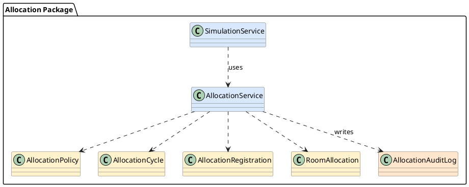
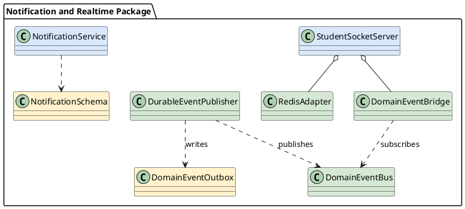
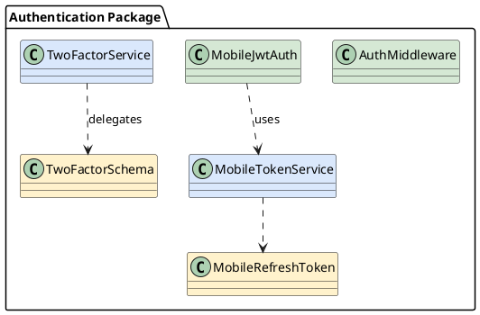

# Hướng dẫn vẽ Class Diagram — 4.1.3

**Phiên bản:** Round 2 (2026-06-01)
**Mục đích:** Cung cấp đủ thông tin để vẽ 3 Class Diagram trong Draw.io mà không cần hỏi thêm.

---

## Tổng quan: 3 diagram cần vẽ

| Diagram | File xuất | Kích thước tham chiếu |
|---------|-----------|----------------------|
| Allocation Package | `diagrams/class_allocation.png` | 0.92\textwidth |
| Notification and Realtime Package | `diagrams/class_notification.png` | 0.92\textwidth |
| Authentication Package | `diagrams/class_auth.png` | 0.86\textwidth |

---

## Quy tắc chung

### Quy tắc hộp lớp (Class box)
- Chỉ hiển thị **tên lớp** (compartment đầu tiên)
- **Không** liệt kê thuộc tính
- **Không** liệt kê phương thức
- Tên lớp dùng font monospace (Courier New) nếu có thể, hoặc Sans-Serif 12pt
- Màu nền: trắng (`#FFFFFF`), viền: xám đậm (`#666666`)

### Quy tắc màu nền theo vai trò
| Vai trò | Màu nền | Hex |
|---------|---------|-----|
| Lớp điều phối (Service trung tâm) | Xanh nhạt | `#DAE8FC` |
| Lớp dữ liệu (Schema/Model) | Vàng nhạt | `#FFF2CC` |
| Lớp middleware/adapter | Xanh lá nhạt | `#D5E8D4` |
| Lớp audit/log | Đỏ nhạt | `#FFE6CC` |

### Quy tắc mũi tên UML
| Loại quan hệ | Ký hiệu Draw.io | Mô tả |
|-------------|-----------------|-------|
| Dependency (`uses`) | Mũi tên đứt nét (`-->`) | Lớp A phụ thuộc vào lớp B |
| Association | Mũi tên liền nét (`->`) | Liên kết hai chiều |
| Aggregation | Mũi tên liền + hình thoi rỗng | Chứa nhưng không sở hữu |
| Composition | Mũi tên liền + hình thoi đặc | Sở hữu hoàn toàn |

**Trong Draw.io:** Chọn connector style → bật/tắt "dashed" cho dependency; chọn "end arrow" = "open" cho association/dependency, "diamond" cho aggregation/composition.

### Quy tắc Package boundary
- Đặt tên package ở góc trên trái của vùng bao
- Vùng bao dùng style: `rounded=1;fillColor=#f5f5f5;strokeColor=#999999;fontStyle=1`
- Caption format: `«package» TênGói`

### Quy tắc khoảng cách
- Khoảng cách tối thiểu giữa 2 hộp: 40px ngang, 30px dọc
- Mũi tên không cắt ngang hộp khác
- Sắp xếp từ trái sang phải hoặc từ trên xuống dưới theo chiều phụ thuộc

### Quy tắc caption (LaTeX)
Format: `\caption{Class Diagram của [Tên Package]}`
Label: `\label{fig:class_[tên viết thường không dấu]}`

---

## Diagram 1: Allocation Package

### Mục đích
Thể hiện cấu trúc lớp của quy trình phân bổ phòng tự động. Trọng tâm là quan hệ giữa lớp điều phối trung tâm và các lớp dữ liệu, cùng vị trí của lớp mô phỏng và lớp nhật ký.

### Danh sách lớp

| Lớp | Vai trò | Màu nền |
|-----|---------|---------|
| `AllocationService` | Điều phối trung tâm | `#DAE8FC` |
| `SimulationService` | Điều phối mô phỏng | `#DAE8FC` |
| `AllocationPolicy` | Lưu chính sách phân bổ | `#FFF2CC` |
| `AllocationCycle` | Biểu diễn phiên phân bổ | `#FFF2CC` |
| `AllocationRegistration` | Đơn đăng ký sinh viên | `#FFF2CC` |
| `RoomAllocation` | Kết quả gán phòng | `#FFF2CC` |
| `AllocationAuditLog` | Nhật ký bất biến | `#FFE6CC` |

### Vị trí bố trí trong Draw.io

```
[SimulationService]
        |
        | uses (-->)
        v
[AllocationService]  -->  [AllocationPolicy]
        |            -->  [AllocationCycle]
        |            -->  [AllocationRegistration]
        |            -->  [RoomAllocation]
        |
        | --> [AllocationAuditLog]
```

Chi tiết tọa độ (pixel, gốc tọa độ trên-trái):
- `AllocationService`: x=240, y=160, w=180, h=60
- `SimulationService`: x=240, y=40, w=180, h=60
- `AllocationPolicy`: x=480, y=40, w=180, h=60
- `AllocationCycle`: x=480, y=120, w=180, h=60
- `AllocationRegistration`: x=480, y=200, w=180, h=60
- `RoomAllocation`: x=480, y=280, w=180, h=60
- `AllocationAuditLog`: x=60, y=280, w=180, h=60

### Quan hệ cần vẽ

| Từ | Đến | Loại | Nhãn |
|----|-----|------|------|
| `SimulationService` | `AllocationService` | dependency (đứt nét) | `«uses»` |
| `AllocationService` | `AllocationPolicy` | dependency (đứt nét) | |
| `AllocationService` | `AllocationCycle` | dependency (đứt nét) | |
| `AllocationService` | `AllocationRegistration` | dependency (đứt nét) | |
| `AllocationService` | `RoomAllocation` | dependency (đứt nét) | |
| `AllocationService` | `AllocationAuditLog` | dependency (đứt nét) | `«writes»` |

### PlantUML tham chiếu



---

## Diagram 2: Notification and Realtime Package

### Mục đích
Thể hiện cấu trúc lớp của hệ thống thông báo thời gian thực. Trọng tâm là quan hệ giữa lớp khởi tạo, lớp cầu nối sự kiện, lớp adapter Redis và hai lớp thông báo bền vững.

### Danh sách lớp

| Lớp | Vai trò | Màu nền |
|-----|---------|---------|
| `StudentSocketServer` | Khởi tạo hạ tầng realtime | `#DAE8FC` |
| `DomainEventBridge` | Cầu nối sự kiện → WebSocket | `#D5E8D4` |
| `DomainEventBus` | EventEmitter nội bộ | `#D5E8D4` |
| `DurableEventPublisher` | Phát sự kiện bền vững | `#D5E8D4` |
| `DomainEventOutbox` | Lưu sự kiện chưa phát | `#FFF2CC` |
| `RedisAdapter` | Pub/Sub qua nhiều instance | `#D5E8D4` |
| `NotificationService` | Quản lý thông báo bền vững | `#DAE8FC` |
| `NotificationSchema` | Lưu bản ghi thông báo | `#FFF2CC` |

### Vị trí bố trí trong Draw.io

```
[DurableEventPublisher] --> [DomainEventOutbox]
        |
        | --> [DomainEventBus]
                    ^
                    | subscribes
                    |
[StudentSocketServer] --> [DomainEventBridge]
        |
        +--> [RedisAdapter]

[NotificationService] --> [NotificationSchema]
```

Chi tiết tọa độ:
- `StudentSocketServer`: x=180, y=160, w=200, h=60
- `DomainEventBridge`: x=440, y=100, w=200, h=60
- `DomainEventBus`: x=440, y=220, w=180, h=60
- `DurableEventPublisher`: x=680, y=100, w=200, h=60
- `DomainEventOutbox`: x=680, y=220, w=200, h=60
- `RedisAdapter`: x=180, y=280, w=180, h=60
- `NotificationService`: x=40, y=400, w=180, h=60
- `NotificationSchema`: x=260, y=400, w=180, h=60

### Quan hệ cần vẽ

| Từ | Đến | Loại | Nhãn |
|----|-----|------|------|
| `StudentSocketServer` | `DomainEventBridge` | aggregation | |
| `StudentSocketServer` | `RedisAdapter` | aggregation | |
| `DomainEventBridge` | `DomainEventBus` | dependency (đứt nét) | `«subscribes»` |
| `DurableEventPublisher` | `DomainEventOutbox` | dependency (đứt nét) | `«writes»` |
| `DurableEventPublisher` | `DomainEventBus` | dependency (đứt nét) | `«publishes»` |
| `NotificationService` | `NotificationSchema` | dependency (đứt nét) | |

### PlantUML tham chiếu



---

## Diagram 3: Authentication Package

### Mục đích
Thể hiện hai luồng xác thực song song (session-based và JWT-based) và các lớp hỗ trợ bảo mật bổ sung (refresh token, TOTP).

### Danh sách lớp

| Lớp | Vai trò | Màu nền |
|-----|---------|---------|
| `AuthMiddleware` | Xác thực session-based (web) | `#D5E8D4` |
| `MobileJwtAuth` | Xác thực JWT-based (mobile) | `#D5E8D4` |
| `MobileTokenService` | Quản lý vòng đời token mobile | `#DAE8FC` |
| `MobileRefreshToken` | Lưu refresh token | `#FFF2CC` |
| `TwoFactorService` | Xác thực TOTP | `#DAE8FC` |
| `TwoFactorSchema` | Lưu bí mật TOTP | `#FFF2CC` |

### Vị trí bố trí trong Draw.io

```
[AuthMiddleware]        [MobileJwtAuth]
                                |
                                | uses (-->)
                                v
                       [MobileTokenService] --> [MobileRefreshToken]

[TwoFactorService] --> [TwoFactorSchema]
  (standalone, không kết nối với nhóm trên)
```

Chi tiết tọa độ:
- `AuthMiddleware`: x=40, y=100, w=180, h=60
- `MobileJwtAuth`: x=280, y=100, w=180, h=60
- `MobileTokenService`: x=280, y=220, w=200, h=60
- `MobileRefreshToken`: x=520, y=220, w=200, h=60
- `TwoFactorService`: x=40, y=340, w=180, h=60
- `TwoFactorSchema`: x=260, y=340, w=180, h=60

### Quan hệ cần vẽ

| Từ | Đến | Loại | Nhãn |
|----|-----|------|------|
| `MobileJwtAuth` | `MobileTokenService` | dependency (đứt nét) | `«uses»` |
| `MobileTokenService` | `MobileRefreshToken` | dependency (đứt nét) | |
| `TwoFactorService` | `TwoFactorSchema` | dependency (đứt nét) | `«delegates»` |

_Lưu ý: `AuthMiddleware` đứng độc lập, không có mũi tên đến nhóm JWT._

### PlantUML tham chiếu



---

## Hướng dẫn từng bước trong Draw.io

1. Mở Draw.io → New Diagram → Blank
2. File → Page Setup: đặt kích thước A4 ngang (1122 × 793 px)
3. Bật grid (View → Grid) với 10px spacing
4. Thêm lớp đầu tiên: kéo thả Rectangle từ panel trái, double-click đặt tên
5. Style hộp: Format → Fill Color → chọn màu theo bảng vai trò
6. Tạo mũi tên: di chuột vào cạnh hộp, kéo mũi tên xanh sang hộp đích
7. Style mũi tên dependency: Right-click connector → Edit Style → thêm `dashed=1;`
8. Thêm nhãn mũi tên: double-click vào mũi tên
9. Thêm package boundary: kéo thả Rectangle lớn bao ngoài các hộp, Format → Fill → `#f5f5f5`, stroke `#999999`; đặt label ở góc trên trái
10. Xuất PNG: File → Export as → PNG → Scale: 300% → Export

---

## Quy tắc đặt caption trong LaTeX

```latex
\begin{figure}[H]
\centering
\includegraphics[width=0.92\textwidth]{diagrams/class_allocation.png}
\caption{Class Diagram của Allocation Package}
\label{fig:class_allocation}
\end{figure}
```

Tỷ lệ width:
- Allocation: `0.92\textwidth`
- Notification: `0.92\textwidth`
- Authentication: `0.86\textwidth`
