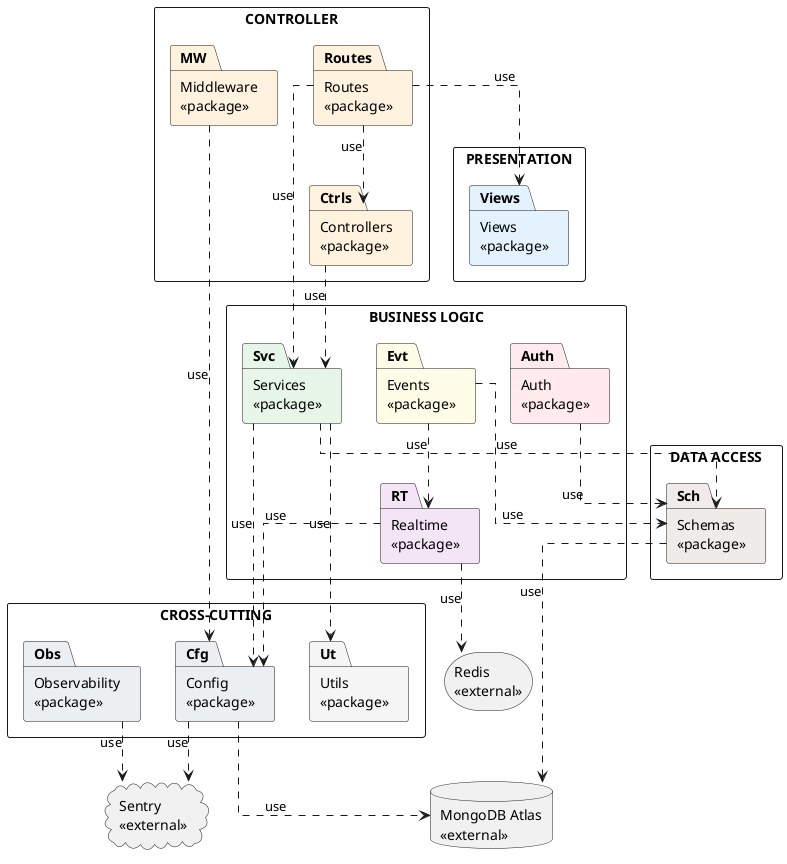

# HƯỚNG DẪN VẼ PACKAGE DIAGRAM — Hệ thống Quản lý Ký túc xá

**Dùng cho:** Draw.io / StarUML / PlantUML  
**Chuẩn:** UML 2.5 Package Diagram  
**Ngày tạo:** 2026-05-30  
**Tương ứng:** Hình 4.1 trong Chương 4 của báo cáo

---

## MỤC TIÊU

Vẽ Hình 4.1 Package Diagram biểu diễn cấu trúc package của **backend Node.js**, thể hiện rõ 5 tầng từ Presentation xuống Infrastructure và các mũi tên phụ thuộc một chiều giữa chúng.

---

## DANH SÁCH ĐẦY ĐỦ CÁC PACKAGE

### Backend (12 package)

| Tên package | Thư mục thực tế | Tầng |
|---|---|---|
| `Views` | `views/` | Presentation |
| `Routes` | `src/routes/` | Controller |
| `Controllers` | `src/controllers/` | Controller |
| `Middleware` | `src/middleware/` | Controller |
| `Services` | `src/services/` | Model (Business Logic) |
| `Realtime` | `src/realtime/` | Model (Business Logic) |
| `Events` | `src/events/` | Model (Business Logic) |
| `Auth` | `src/auth/` | Model (Business Logic) |
| `Schemas` | `src/schemas/` | Model (Data) |
| `Config` | `src/config/` | Cross-cutting |
| `Utils` | `src/utils/` | Cross-cutting |
| `Observability` | `src/observability/` | Cross-cutting |

### Infrastructure (3 external)

| Tên | Kiểu | Ghi chú |
|---|---|---|
| `MongoDB Atlas` | `«external»` | Cloud database |
| `Redis` | `«external»` | Socket.IO cluster adapter |
| `Sentry` | `«external»` | Error monitoring |

---

## BỐ TRÍ PACKAGE THEO TẦNG (từ trên xuống dưới)

```
╔══════════════════════════════════════════════════════════╗
║  TẦNG 1 — PRESENTATION                                   ║
║  ┌─────────────────┐                                     ║
║  │ «package»       │                                     ║
║  │ Views (EJS)     │                                     ║
║  └─────────────────┘                                     ║
╚══════════════════════════════════════════════════════════╝

╔══════════════════════════════════════════════════════════╗
║  TẦNG 2 — CONTROLLER                                     ║
║  ┌──────────────┐  ┌──────────────┐  ┌───────────────┐  ║
║  │ «package»    │  │ «package»    │  │ «package»     │  ║
║  │ Routes       │  │ Controllers  │  │ Middleware    │  ║
║  └──────────────┘  └──────────────┘  └───────────────┘  ║
╚══════════════════════════════════════════════════════════╝

╔══════════════════════════════════════════════════════════╗
║  TẦNG 3 — MODEL / BUSINESS LOGIC                         ║
║  ┌──────────┐  ┌──────────┐  ┌──────────┐  ┌────────┐  ║
║  │«package»│  │«package»│  │«package»│  │«package│  ║
║  │Services │  │Realtime │  │Events   │  │Auth    │  ║
║  └──────────┘  └──────────┘  └──────────┘  └────────┘  ║
╚══════════════════════════════════════════════════════════╝

╔══════════════════════════════════════════════════════════╗
║  TẦNG 4 — DATA ACCESS                                    ║
║  ┌──────────────────────────────┐                        ║
║  │ «package»                    │                        ║
║  │ Schemas (Mongoose Models)    │                        ║
║  └──────────────────────────────┘                        ║
╚══════════════════════════════════════════════════════════╝

╔══════════════════════════════════════════════════════════╗
║  TẦNG 5 — CROSS-CUTTING (ngang hàng, giữa tầng 3 và 4)  ║
║  ┌──────────┐  ┌──────────┐  ┌──────────────────┐       ║
║  │«package»│  │«package»│  │«package»         │       ║
║  │Config   │  │Utils    │  │Observability     │       ║
║  └──────────┘  └──────────┘  └──────────────────┘       ║
╚══════════════════════════════════════════════════════════╝

╔══════════════════════════════════════════════════════════╗
║  TẦNG 6 — INFRASTRUCTURE (external)                      ║
║  ┌──────────────┐  ┌──────────┐  ┌──────────┐           ║
║  │ «external»   │  │«external│  │«external│           ║
║  │ MongoDB      │  │Redis    │  │Sentry   │           ║
║  │ Atlas        │  │         │  │         │           ║
║  └──────────────┘  └──────────┘  └──────────┘           ║
╚══════════════════════════════════════════════════════════╝
```

---

## DANH SÁCH MŨI TÊN PHỤ THUỘC

Tất cả mũi tên dùng **đường đứt nét với đầu mũi tên mở** (UML dependency: `- - - ->`).

### Từ Tầng 2 xuống các tầng dưới

```
Routes       --«use»--> Controllers
Routes       --«use»--> Services
Routes       --«use»--> Views
Controllers  --«use»--> Services
Middleware   --«use»--> Config
```

### Từ Tầng 3 xuống các tầng dưới

```
Services     --«use»--> Schemas
Services     --«use»--> Utils
Services     --«use»--> Config

Realtime     --«use»--> Config
Realtime     --«use»--> Redis       [external]

Events       --«use»--> Schemas
Events       --«use»--> Realtime

Auth         --«use»--> Schemas
```

### Từ Tầng 4 xuống Infrastructure

```
Schemas      --«use»--> MongoDB Atlas   [external]
```

### Cross-cutting đến Infrastructure

```
Config       --«use»--> MongoDB Atlas   [external]
Config       --«use»--> Sentry          [external]
Observability --«use»--> Sentry         [external]
```

### Tổng hợp: mũi tên KHÔNG được vẽ

Để tránh vi phạm nguyên tắc thiết kế, **không vẽ** các mũi tên sau:

- Schemas → Services (phụ thuộc ngược)
- Services → Routes (phụ thuộc ngược)
- Routes → Schemas trực tiếp (bỏ qua tầng) — ngoại lệ cho truy vấn đọc đơn giản có thể bỏ qua
- Bất kỳ cặp nào tạo thành vòng lặp

---

## CHI TIẾT TỪNG PACKAGE

### Package: `Views`

- **Stereotype:** `«package»`
- **Tầng:** Presentation
- **Màu nền gợi ý:** Xanh lam rất nhạt (#E3F2FD)
- **Mô tả:** Template EJS render HTML phía server. Bao gồm layout, trang admin, trang sinh viên và partial components (header, footer, nav).
- **Phụ thuộc vào:** không package nào trong backend (chỉ nhận data từ Routes qua res.render())

---

### Package: `Routes`

- **Stereotype:** `«package»`
- **Tầng:** Controller
- **Màu nền gợi ý:** Cam nhạt (#FFF3E0)
- **Mô tả:** Toàn bộ Express route definitions. Phân nhánh theo tác nhân:
  - `src/routes/admin/` — 11 file cho admin operations
  - `src/routes/student/` — student portal routes
  - `src/routes/student/mobile/` — 8 file REST API cho mobile
  - Các route chung: allocation, health, auth, notification, room-viewer
- **Phụ thuộc vào:** `Controllers`, `Services`, `Views`, `Middleware`

---

### Package: `Controllers`

- **Stereotype:** `«package»`
- **Tầng:** Controller
- **Màu nền gợi ý:** Cam nhạt (#FFF3E0)
- **Mô tả:** Logic xử lý request cho các module phức tạp hơn (hiện có `src/controllers/admin/quota-admin-controller.js`). Tách biệt controller logic khỏi route definition để dễ unit test.
- **Phụ thuộc vào:** `Services`, `Config`

---

### Package: `Middleware`

- **Stereotype:** `«package»`
- **Tầng:** Controller
- **Màu nền gợi ý:** Cam nhạt (#FFF3E0)
- **Mô tả:** Các Express middleware xuyên suốt request pipeline:
  - `auth.js` — session-based auth (web)
  - `mobileJwtAuth.js` — JWT auth (mobile)
  - `security.js` — Helmet, rate limiter, XSS, sanitize input
  - `requireQuotaAdmin.js` — role guard
  - `yearGroupAccess.js` — year-based access control
- **Phụ thuộc vào:** `Config`

---

### Package: `Services`

- **Stereotype:** `«package»`
- **Tầng:** Model / Business Logic
- **Màu nền gợi ý:** Xanh lục nhạt (#E8F5E9)
- **Ghi chú:** Package lớn nhất — 13 service files
- **Mô tả:** Toàn bộ logic nghiệp vụ của hệ thống. Không nhận HTTP request trực tiếp.

| Service file | Vai trò |
|---|---|
| `allocationService.js` | Allocation Engine lõi — tính điểm, xếp hạng, gán phòng |
| `simulationService.js` | Chế độ preview — chạy allocation không commit |
| `enhancedApplicationService.js` | Xử lý đơn đăng ký nâng cao |
| `academicYearService.js` | Quản lý chu kỳ học năm |
| `notificationService.js` | Gửi thông báo đa kênh |
| `quotaWorkflowService.js` | Workflow phân bổ chỉ tiêu |
| `cohortShiftService.js` | Dịch chuyển nhóm sinh viên |
| `studentMobileService.js` | Facade cho mobile API |
| `twoFactorService.js` | TOTP/2FA |
| `roomViewerService.js` | 360° room viewer |

- **Phụ thuộc vào:** `Schemas`, `Utils`, `Config`

---

### Package: `Realtime`

- **Stereotype:** `«package»`
- **Tầng:** Model / Business Logic
- **Màu nền gợi ý:** Tím nhạt (#F3E5F5)
- **Mô tả:**
  - `student-socket-server.js` — Socket.IO server, namespaces, xác thực kết nối
  - `redis-adapter.js` — gắn Redis Adapter vào Socket.IO
  - `register-domain-event-bridge.js` — bridge Domain Events → Socket.IO emit
- **Phụ thuộc vào:** `Config`, `Redis [external]`

---

### Package: `Events`

- **Stereotype:** `«package»`
- **Tầng:** Model / Business Logic
- **Màu nền gợi ý:** Vàng nhạt (#FFFDE7)
- **Mô tả:** Outbox pattern cho reliable event delivery:
  - `domain-events.js` — định nghĩa event types
  - `durable-event-publisher.js` — dispatcher đọc outbox và publish
  - `event-transport.js` — transport layer
- **Phụ thuộc vào:** `Schemas` (DomainEventOutboxSchema), `Realtime`

---

### Package: `Auth`

- **Stereotype:** `«package»`
- **Tầng:** Model / Business Logic
- **Màu nền gợi ý:** Đỏ nhạt (#FFEBEE)
- **Mô tả:**
  - `mobileTokenService.js` — issue JWT access/refresh token, verify, anomaly detection
- **Phụ thuộc vào:** `Schemas` (MobileRefreshTokenSchema)

---

### Package: `Schemas`

- **Stereotype:** `«package»`
- **Tầng:** Data Access
- **Màu nền gợi ý:** Nâu nhạt (#EFEBE9)
- **Ghi chú:** 19+ Mongoose schema files — package lớn thứ hai
- **Mô tả:** Định nghĩa toàn bộ MongoDB collections. Mỗi file = 1 collection.

Các schema quan trọng:
- `config.js` → `students`
- `RoomSchema.js` → `rooms`
- `RoomAllocationSchema.js` → `roomallocations`
- `AllocationCycleSchema.js` → `allocationcycles`
- `AllocationPolicySchema.js` → `allocationpolicies`
- `AllocationAuditLogSchema.js` → `allocationauditlogs`
- `DomainEventOutboxSchema.js` → `domaineventoutboxes`
- `MobileRefreshTokenSchema.js` → `mobilefreshtokens`
- `ViolationSchema.js` → `violations`
- `MaintenanceRequestSchema.js` → `maintenancerequests`
- `NotificationSchema.js` → `notifications`
- `TwoFactorSchema.js` → `twofactors`

- **Phụ thuộc vào:** `MongoDB Atlas [external]`

---

### Package: `Config`

- **Stereotype:** `«package»`
- **Tầng:** Cross-cutting
- **Màu nền gợi ý:** Xám nhạt (#ECEFF1)
- **Mô tả:**
  - `config.js` — Mongoose connection + StudentSchema export
  - `logger.js` — Winston logger instance (JSON format)
  - `sentry.js` — Sentry initialization (phải require trước mọi module)
  - `validateEnv.js` — Validate environment variables, fail-fast
- **Phụ thuộc vào:** `MongoDB Atlas [external]`, `Sentry [external]`

---

### Package: `Utils`

- **Stereotype:** `«package»`
- **Tầng:** Cross-cutting
- **Màu nền gợi ý:** Xám rất nhạt (#F5F5F5)
- **Mô tả:**
  - `priorityCalculator.js` — Tính điểm ưu tiên (dùng bởi Allocation Engine)
  - `notificationHelper.js` — Helper gửi thông báo đa kênh
  - `mobileResponse.js` — Format JSON response cho mobile API
  - `sendEmail.js` — nodemailer wrapper
  - `workflowConstants.js` — Workflow state constants
  - `quotaConfig.js` — Quota constants
  - `labels.js` — Vietnamese label mappings
- **Phụ thuộc vào:** `Config`

---

### Package: `Observability`

- **Stereotype:** `«package»`
- **Tầng:** Cross-cutting
- **Màu nền gợi ý:** Xám nhạt (#ECEFF1)
- **Mô tả:**
  - `observability.js` — Request logger middleware (requestLogger)
  - `tracing.js` — OpenTelemetry tracing setup
- **Phụ thuộc vào:** `Sentry [external]`

---

## HƯỚNG DẪN VẼ TRONG DRAW.IO — TỪNG BƯỚC

### Bước 1: Tạo canvas

- File → New (hoặc Ctrl+N)
- Diagram type: Blank
- Bật Grid: View → Grid (Ctrl+Shift+H)
- Grid size: 10px
- Page size: A3 landscape (nếu muốn đủ chỗ)

### Bước 2: Vẽ 6 container (hình chữ nhật lớn)

Vẽ 6 hình chữ nhật xếp dọc từ trên xuống, chiều rộng bằng nhau (~1200px):

| Container | Màu nền | Chiều cao |
|---|---|---|
| TẦNG 1 — PRESENTATION | #E3F2FD | 120px |
| TẦNG 2 — CONTROLLER | #FFF3E0 | 150px |
| TẦNG 3 — BUSINESS LOGIC | #E8F5E9 | 150px |
| TẦNG 4 — DATA ACCESS | #EFEBE9 | 120px |
| TẦNG 5 — CROSS-CUTTING | #F5F5F5 | 120px |
| TẦNG 6 — INFRASTRUCTURE | #ECEFF1 | 120px |

Đặt nhãn tên tầng (in đậm, màu xám đậm) ở góc trên trái mỗi container.

### Bước 3: Vẽ các package bên trong container

Trong mỗi container, vẽ các hình chữ nhật nhỏ hơn theo dạng UML Package:
- Góc trên trái: tab nhỏ (hình chữ nhật nhỏ hơn, cao ~20px)
- Bên trong tab: tên package, in đậm
- Dưới tên: stereotype `«package»` hoặc `«external»`

**Cách vẽ nhanh trong Draw.io:**
- Search shape: gõ "uml package" trong thanh tìm kiếm shape
- Kéo shape `Package` từ UML library vào canvas

### Bước 4: Vẽ mũi tên phụ thuộc

Mũi tên UML dependency:
- Loại: **Dashed line với Open Arrow head** (không phải filled arrow)
- Draw.io: Right-click → Edit Connection → chọn "Dashed" + "Open" arrowhead
- Label: `«use»` (tuỳ chọn, có thể bỏ qua cho gọn)

Vẽ theo danh sách mũi tên ở phần **DANH SÁCH MŨI TÊN PHỤ THUỘC** phía trên.

### Bước 5: Thêm Legend

Vẽ một box nhỏ ở góc dưới phải:

```
LEGEND:
□ «package»  — Internal module
□ «external» — External system
- - → «use» dependency
```

---

## PLANTÚML (tuỳ chọn thay thế Draw.io)

Dán vào https://www.plantuml.com/plantuml/uml/ để render nhanh:



---

## GHI CHÚ QUAN TRỌNG

1. **Redis** chỉ được kết nối từ package `Realtime` — không phải toàn bộ backend
2. **Sentry** được kết nối từ `Config` và `Observability`
3. **MongoDB Atlas** được kết nối từ `Schemas` và `Config` (khởi tạo connection)
4. **Routes** có thể gọi trực tiếp `Services` (không bắt buộc qua Controllers cho mọi route)
5. Mobile App là hệ thống hoàn toàn tách biệt — vẽ trên diagram riêng hoặc sang phải của backend diagram với đường kết nối **HTTPS/WSS**
